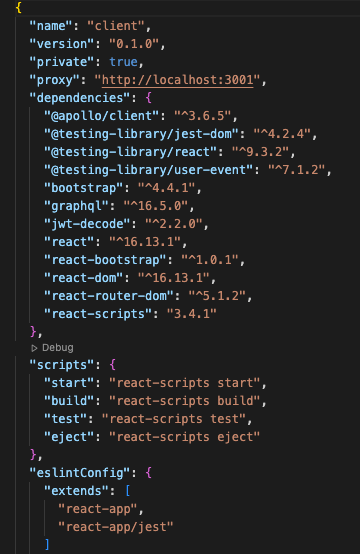
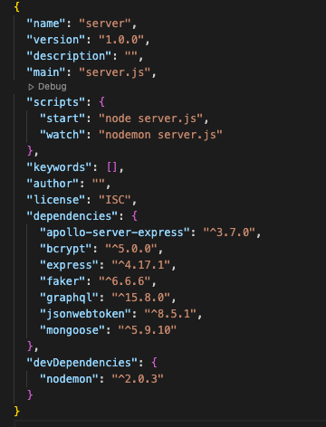
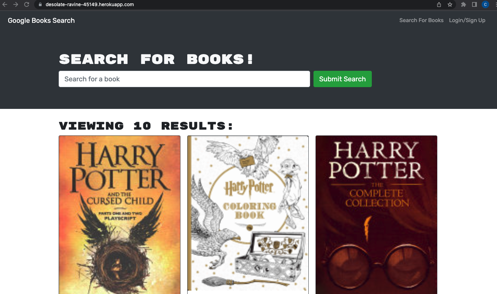

# Book Search Engine Starter Code

<h1 align="center">Google Books Search</h1>

## Table of Contents

* [Description](#description)
* [BuiltWith](#built-with)
* [Installation](#installation) 
* [Deployed Application](#deployed-application)
* [Contributor](#contributor)

## Description

This challenge is to refract a perfectly functioning Google Books API search engine that is built with a RESTful API and update it to be a GraphQL API using Apollo Server. This is a MERN stack application using MongoDB, Express.js, React, and Node.js. This MERN challenge allows the developer to become more familiar with the complexities of authentication middleware adjacent to a GraphQL API, using Apollo Provider to ensure requests communicate with Apollo Server, and use Apollo Server to access GraphQL queries and mutations to replace the RESTful API method. Please note this assignment was completed with the use of [starter code](https://github.com/coding-boot-camp/solid-broccoli).  

## Built With

* JavaScript
* Node.js
* Express
* GraphQL
* React
* Apollo Client
* Apollo Server
* Concurrently
* JWT

## Installation

1. Before installing, clone starter code. Run `npm install` from both the root of the client directory and server directory. Check to ensure dependencies looks similiar to the following in the package.json files in both directories:

Client

</img>

Server

</img>

2. In the root of the project be sure to run `npm i concurrently` to connect both the front and back end.

3. To start the server run `npm run develop` in the root directory. The React browser will open.

## Deployed Application

[Heroku Deployment](https://desolate-ravine-45149.herokuapp.com/)

</img>

## GitHub Repository

[Book Search Engine](https://github.com/chloeyarb/Book-Search-Engine/tree/main)

## Contributor

Chloe Yarborough

Connect with me on [GitHub](https://github.com/chloeyarb)!
